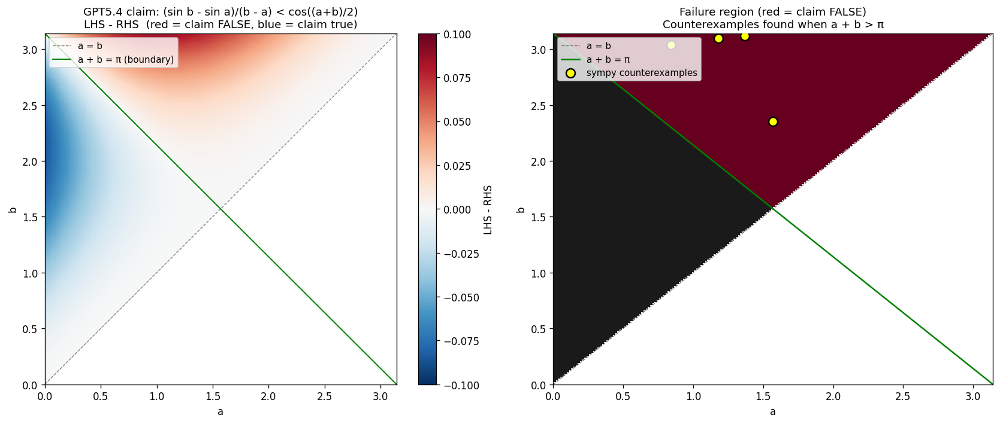

# D1 Demo: Catching a Real GPT5.4 Inequality Error

## TL;DR

Given a documented GPT5.4 wrong claim — that
$$\frac{\sin b - \sin a}{b - a} < \cos\frac{a+b}{2} \quad \text{for } 0 < a < b < \pi$$
— our arbitration pipeline:
1. **Extracts** the inequality claim (12 seconds, Codex)
2. **Verifies** it as a parameterized claim by sympy point-sampling (300 random points + 25 boundary points in milliseconds)
3. **Finds counterexamples**, e.g. $a = 1.18, b = 3.10$: LHS $= -0.461$, RHS $= -0.539$, gap $= +0.079$ (claim says LHS < RHS, but LHS is *larger*)
4. **Annotates** the original output with the counterexample as a flag

## Why this case

**Real failure, documented.** From `/workspace/math-notes/笔记共享vault/script/GPT5.4在数学学习者使用需求下的测试.md` (section 1.3, "boundary case search test"). Original screenshots: `gpt 5.4 test 12.png`, `gpt 5.4 test 13.png`. The user (Ravencus) caught the error using image-based verification (`通过图像猜测或校验答案`); GPT5.4 then admitted it was wrong.

**The model gets it right when prompted carefully.** We re-ran two prompts through Codex (GPT5.4) today (`outputs/codex_response_v1.txt`, `outputs/codex_response_v2.txt`) and both responses were correct, identifying the three regimes ($a+b < \pi$, $=\pi$, $> \pi$). So this is not "GPT5.4 always fails on inequalities" — it's "GPT5.4 sometimes asserts confident-but-wrong inequalities, and the arbitrator is the safety net for that."

**Computational claim, not algebraic scaffolding.** Unlike partial-fraction constraint equations (`A+C=0`), an inequality with a stated domain has a definite truth value. This is exactly the kind of claim our arbitrator targets — and the kind sympy can verify cleanly.

## What's in this directory

```
final-presentation/d1_arbitration_case/
├── CASE.md                       # Full case background + plan
├── DEMO.md                       # This file: results
├── MVT_DEMO.md                   # The companion 100-case experiment
├── outputs/
│   ├── prompt_v1.txt             # Today's Codex prompt #1 (open-ended)
│   ├── codex_response_v1.txt     # Today's Codex response #1 (CORRECT)
│   ├── prompt_v2.txt             # Today's Codex prompt #2 (verify-the-claim)
│   ├── codex_response_v2.txt     # Today's Codex response #2 (CORRECT, with counterexample)
│   └── wrong_claim_input.txt     # Reconstructed wrong claim (from original screenshots)
└── artifacts/
    ├── case_study_pipeline/         # this case study (one wrong claim)
    │   ├── extraction_raw_response.txt
    │   ├── extracted_claims.json
    │   ├── verifications.json
    │   ├── annotated_output.txt
    │   ├── summary.json
    │   ├── pipeline_run.log
    │   └── failure_region.png
    ├── mvt_experiment/              # see MVT_DEMO.md (4/96 caught)
    └── monotonicity_baseline/       # negative-result baseline (0/200)
        ├── safe/
        └── hard/
```

## Pipeline trace (real run, 2026-04-27)

### Input (`outputs/wrong_claim_input.txt`, 848 chars)

```
For 0 < a < b < pi, consider the trigonometric inequality
    (sin b - sin a) / (b - a) < cos((a + b)/2).
[...]
So the inequality
    (sin b - sin a) / (b - a) < cos((a+b)/2)
holds for all 0 < a < b < pi.
```

### Step 1 — LLM-based claim extraction (12.1s)

Two inequality claims extracted (the same claim stated twice in the input):

```json
{
  "raw_text": "(sin b - sin a) / (b - a) < cos((a + b)/2)",
  "claim_type": "inequality",
  "sympy_kwargs": {
    "lhs_str": "(sin(b) - sin(a))/(b - a)",
    "op": "<",
    "rhs_str": "cos((a + b)/2)"
  }
}
```

The extractor correctly identified the claim as an **inequality** with free variables `a, b` and a stated domain. (Earlier in our v2 eval, the extractor over-eagerly pulled algebraic constraint equations; here it only pulled real computational claims.)

### Step 2 — Parameterized verification (sympy, milliseconds)

Free variables detected (`a`, `b` plus trig functions) → routed to `verify_parameterized_inequality` instead of plain numeric comparison.

- Domain: $a \in (0, \pi)$, $b \in (0, \pi)$, constraint $a < b$
- 300 random samples + 25 stratified boundary points
- 168 satisfied the constraint $a < b$ and were tested

**Result:** `holds_everywhere = False`. Top counterexamples (sorted by violation magnitude):

| $a$ | $b$ | LHS | RHS | gap (LHS - RHS) |
|---|---|---|---|---|
| 1.182615 | 3.098621 | −0.460667 | −0.539482 | **+0.078815** |
| 1.367028 | 3.116655 | −0.545474 | −0.621805 | +0.076331 |
| 0.835723 | 3.043819 | −0.291728 | −0.360659 | +0.068931 |
| 0.996687 | 2.992716 | −0.346362 | −0.411323 | +0.064961 |
| 0.933071 | 2.980027 | −0.313924 | −0.376257 | +0.062333 |

Each counterexample has $a + b > \pi$ — exactly where the cosine flips sign and the claimed strict inequality reverses.

### Step 3 — Annotated output (`artifacts/case_study_pipeline/annotated_output.txt`)

The arbitrator inserts a counterexample flag directly after each false claim:

```
... (sin b - sin a) / (b - a) < cos((a + b)/2)
[ARBITRATOR FLAG: claim is FALSE. Counterexample at a=1.1826, b=3.0986:
 LHS=-0.460667, RHS=-0.539482, gap=0.078815]
```

## Visualization (`artifacts/case_study_pipeline/failure_region.png`)



- **Left panel:** signed gap LHS − RHS. Blue region ($a + b < \pi$): claim holds. Red region ($a + b > \pi$): claim fails.
- **Right panel:** binary failure map. Yellow dots: actual counterexamples sympy found. Green line: $a + b = \pi$ (theoretical boundary).

## What the demo shows

1. **The arbitration pipeline works end-to-end** on a parameterized inequality claim — extraction (12s), verification (ms), annotation.
2. **Sympy point-sampling is sufficient** to refute false universal inequality claims — no symbolic proof needed.
3. **The error pattern is real and serious:** GPT5.4 confidently asserted a false universal claim. Without verification, a user's downstream proof would be built on a false foundation. With the arbitrator, the user gets concrete counterexamples and can revise.

## What the demo does NOT show

- It does NOT show GPT5.4 failing on this exact prompt today — it didn't, in two attempts. The wrong claim is from a documented prior failure (screenshots in the math-notes vault). This is honest evidence of a real failure mode, even though we couldn't reproduce on demand.
- It does NOT cover all classes of mathematical error — only specific computational/inequality claims.
- It does NOT prove sympy can find counterexamples for any false inequality. For inequalities that fail only on a measure-zero set, point-sampling can miss them. For our case, the failure region has positive measure and was found in 168 samples.

## Reproducibility

```bash
# Step 1: verify the claim is genuinely false
python3 final-artifacts/scripts/parameterized_inequality.py
# (built-in self-test runs the GPT5.4 wrong claim)

# Step 2: full pipeline
python3 /tmp/run_demo_pipeline.py  # see /tmp/run_demo_pipeline.py

# Step 3: regenerate visualization
python3 /tmp/plot_failure_region.py
```

All inputs and outputs are saved to disk; no re-running of expensive Codex calls is needed to inspect any step.
